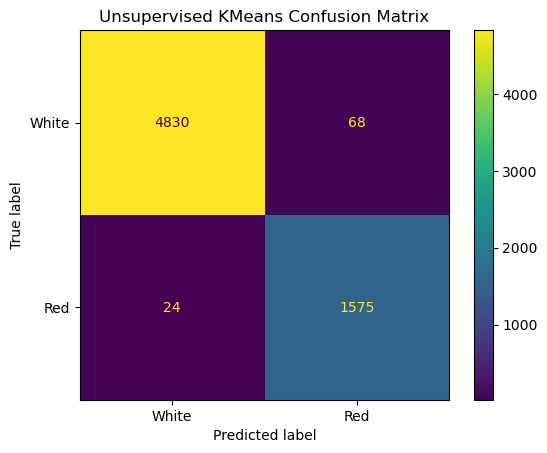
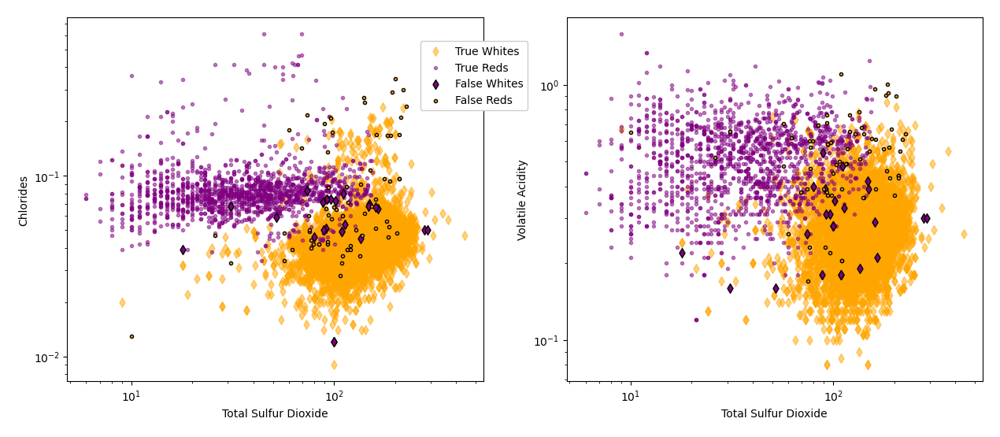
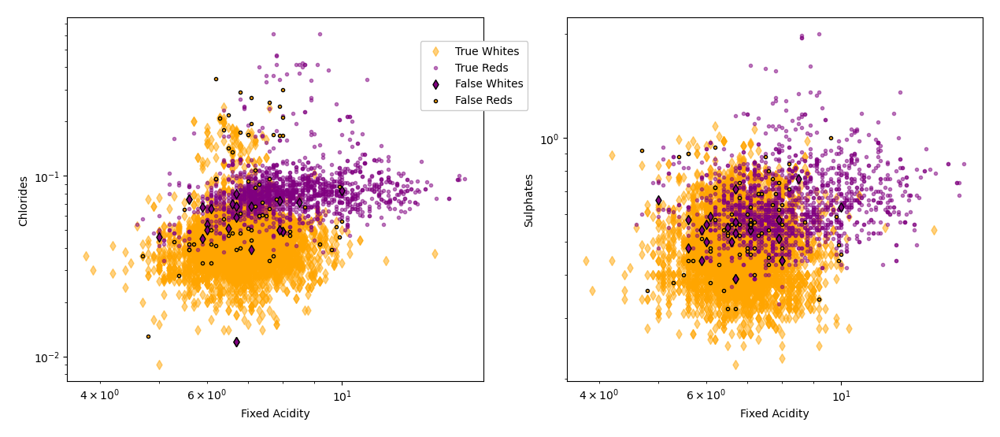
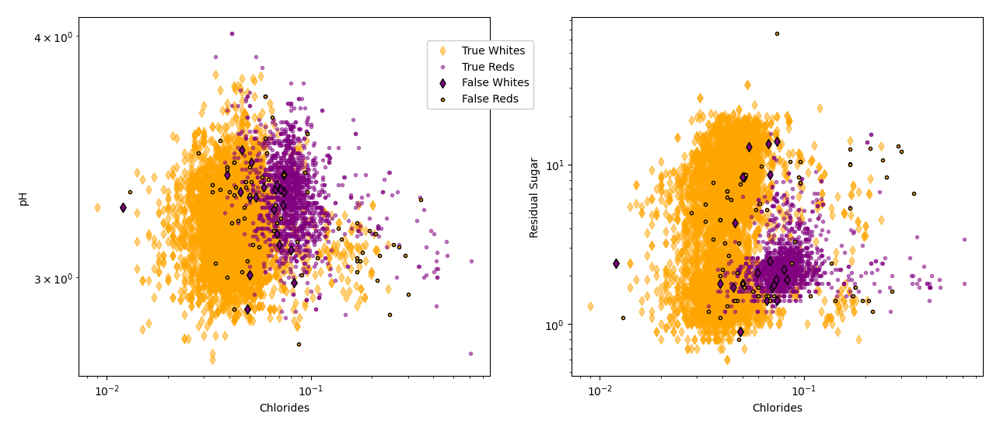

# Vinho Verde Wine Classification  
Final Project of Wine Classification for the Aug. '22 - Feb. '23 UNC Data Analytics Bootcamp by Darius Chancy, Niklaus Dollhopf, Kenneth Gaynor, Catherine Smith, & Browning Wipper.

## Introduction

*Vinho Verde*  is a grouping of wines from the northern *Minho* region of Portugal. The wine grouping and region are legally defined and further enforced by the Comissão de Viticultura da Região dos Vinhos Verdes (CVRVV, *Vinho Verde Region Viticulture Commission*) via setting various standards each wine should meet. One set of standards includes the chemical composition of the wines designated as Vinho Verde, for which the CVRVV offers testing and accreditation. The CVRVV also orchestrates sensory (taste) tests for each wine.  

To explore the capabilities of various machine learning algorithms in the space of wine making, P. Cortez *et al.* (2009) compiled [and utilized] a collection of 4,898 white and 1,599 red vinho verde wines with "physico-chemical" measurements and quality ratings from the CVRVV. Available publically, these collections provide an introduction to machine learning and classification.  

As our final project, we try our hand at utilizing the vinho verde wine data. The first question we ask is if we can use the 11 physico-chemical measurements as model features to accurately predict the qualities of each wine. A second question we ask is whether a naive physico-chemical clustering can separate the red and white wines.

## Provided Data
Each column provided in the datasets is described below. From the work of Cortez *et al.* (2009), the data is already clean and there are no missing values. 

#### Fixed Acidity  
The measure of tartaric acid in the wines, measured in grams per Liter (g/L, reported at the CVRVV as grams per cubic decimeter). Tartaric acid contributes both to the chemical stability of the wine and flavor profile. For red and white wines, the CVRVV sets a minimum of 4.5 g/L.  

#### Volatile Acidity  
The measure of acetic acid in the wines, measured in g/L. Acetic acid is responsible for how much of a vinegar taste exists in the wine. The CVRVV sets a maximum of 1.20 g/L for red wines and 1.08 g/L for white wines.  

#### Citric Acid  
The measure of citric acid in the wines, measured in g/L. While not naturally occuring in grapes in large amounts, citric acid is the familiar taste of citrus fruits (e.g. oranges) and allowed as an additive for removal of iron and copper. A maximum of 1.00 g/L for both red and white wines is set by the CVRVV.  

#### Residual Sugar
A measure of the amount of sugar left over after the fermentation process, measured in g/L. Typically a mix primarily of glucose and fructose, but the specific lab test conducted by the CVRVV lab is unknown. There are no minimum or maximuml limits set by the CVRVV.  

#### Chlorides  
The measure of sodium chloride, salt, in the wine, measured in g/L. The maximum limits set by the CVRVV are 1 g/L for both red and white wines.  

#### Free and Total Sulfur Dioxide  
Measures of the amount of sulfur dioxide in the wine, measured in milligrams per Liter (mg/L, 1000 mg/L is 1 g/L). Used as a chemical stabilizer, free sulfur dioxide refers to sulfur dioxide existing in its sole molecular form whereas total sulfur dioxide further includes sulfur dioxide that has been chemically bound to other molecules. The maximimum limits set by the CVRVV vary depending on the amount of sugar in the wine.  

#### Density  
The density of the wine, measured in grams per milliliter (g/mL). Plain water has a density of about 1 g/mL, and alcohol (ethanol) has a density just under 0.8 g/mL.  

#### pH  
The pH of the wine, measured on the unitless pH scale. Nominally ranging from 0-14, a neutral pH is about 7, such as water, and acidic solutions are less than 7. 

#### Sulphates  
A measure of potassium sulphates in the wine (potentially potassium metabisulphite) in g/L. Primarily used as chemical stabilizers, the CVRVV sets upper limits of 2 g/L for red and white wines.  

#### Alcohol
The measure of alcohol in the wine, expressed as a percentage of volume. For red and white wines, the CVRVV sets a minimum total alcohol of 8% and maximum total alcohol of 14%.

#### Quality  
Blind taste tests were performed by professional wine makers and tasters. The rating was a scale from 0-10, with 0 being 
"very bad" and 10 being "excellent". Each wine was taste-tested by at least 3 people and the median of the scores was taken as the quality. 

 

## Can Physico-Chemical Measurements Predict Quality  

### Step 1 

 

## Naive Physico-Chemical Clustering

Quite readily, red and white wines are easily distinguishable from just the colors. As well, many people will be able to, at least vaguely, describe general differences in flavor profiles between red and white wines. Because flavor profiles are, most basically, a composition of chemicals, can a computer differentiate between red and white wines based on the 11 physico-chemical measurements in these datasets?  

### Method  

The idea of naive clustering requires using only the physico-chemical measurements of the data and ignoring the quality column. To that end, we require an unsupervised learning algorithm; that is, we do not provide any testing data with the correct answers.  

The tool of choice is scikit-learn's K-means algorithm (the KMeans class); since we want to attempt splitting into red and white wines, we will use 2 clusters. With 11 physico-chemical columns, the KMeans algorithm will work in 11-dimensional space and separate the two clusters based on 11th-dimension Euclidean distance. The algorithm is iterative until reaching a stopping point of, roughly, when the average distance from each point to the cluster centroid of each class are equal.  

As noted above, there are no missing values in the data, so no observations were removed. The quality column was dropped. Each dataset was encoded by the type of wine (1 for red, 0 for white) before being combined into a single pandas DataFrame. The type was split off for the K-means algorithm and was only kept as an answer key. The physico-chemical measurements were scaled using scikit-learn's StandardScaler class, which calculates the z-score for each observation column-wise. The KMeans class was instantiated with default options, except for the number of clusters, which was set to 2. The KMeans was fit to the data and each observation was given a predicted class.  

### Result  

The KMeans algorithm clustered similar 11-dimensional datapoints and assigned classes to differentiate between the two clusters; the algorithm did not designate a cluster as 'white' or 'red'. If we assume the algorithm will separate the wines based on chemical differences correctly, we will be able to quantify *how* correctly the algorithm worked because we have the answers. Working on this assumption, we take prediction class 0 to be white wines and prediction class 1 to be red wines.  

Below is a confusion matrix from the KMeans-predicted classes and the known types,  
  

The KMeans model correctly grouped 4830 of the 4898 (98.6%) white wines and 1575 of the 1599 (98.5%) red wines, giving a balanced accuracy of 98.55%. With this accuracy, we confidently posit the red and white wines are chemically differentiable.  

It's not possible to directly plot the results in 11 dimensions, but we can visualize the results in various 2-dimensional scatter plots. In the following plots, all white wines are plotted in orange and the red wines are plotted in purple. Wines predicted to be red (given prediction class 1) are show as circles and wines predicted to be white (given prediction class 0) are shown as diamonds. Therefore, false reds, white wines that were predicted to be red, are orange circles and false whites, red wines predicted to be white, are purple diamonds. The falsely-predicted wines are further outlined in black. Additionally, each image is plotted on a log scale to center and highlight the variables.  

From the histograms above, we aim to use features that show separation between the two types of wine, such as the total sulfur dioxide (conversely, e.g., alcohol content is not useful for visualization). The first two scatter plots are the chloride contents and volatile acidity contents against the total sulfur dioxide measurements.  
  

The next set of scatter plots feature the chloride contents and sulphates content against the fixed acidity measurements.  
  

The last set of scatter plots highlighted here feature the pH levels and residual sugar contents against the chlorides measurements.  
  

From the above scatter plots and histograms, we can see how outliers within a wine type can lead to a misclassification. With that in mind, however, the aim was not to attempt a perfectly accurate classification schema. Rather, we suggest embracing the occasional avant-garde flavor profile while enjoying the myriad of vinho verde wines available.

   

## Citations  

*With some information available only in Portuguese, Google Translate was used and some mistranlations may have occurred*  
Primary paper: P. Cortez, A. Cerdeira, F. Almeida, T. Matos and J. Reis. Modeling wine preferences by data mining from physicochemical properties. In Decision Support Systems, Elsevier, 47(4):547-553, 2009.  
Overview: https://en.wikipedia.org/wiki/Vinho_Verde  
About CVRVV: https://portal.vinhoverde.pt/pt/quem-somos  
CVRVV Lab: https://portal.vinhoverde.pt/pt/analise-fisicoquimica-e-sensorial-processoCertificacao  
CVRVV red requirements: https://portal.vinhoverde.pt/pt/produtos-regras-de-conformidade/VVT  
CVRVV white requirements: https://portal.vinhoverde.pt/pt/produtos-regras-de-conformidade/VVB  
Various acids in wine: https://en.wikipedia.org/wiki/Acids_in_wine  
Scikit-learn: https://scikit-learn.org/stable/index.html  
