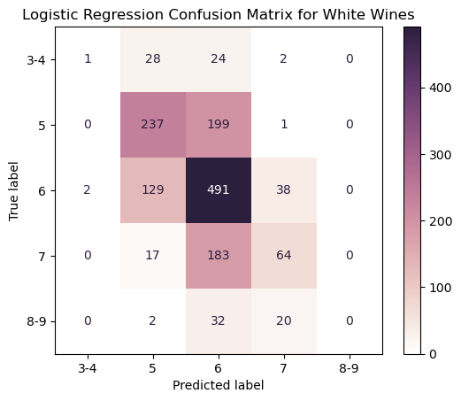

# Vinho Verde Wine Classification  
Final Project of Wine Classification for the Aug. '22 - Feb. '23 UNC Data Analytics Bootcamp by Darius Chancy, Niklaus Dollhopf, Ken Gaynor, Catherine Smith, & Browning Wipper.

## Introduction

*Vinho Verde*  is a grouping of wines from the northern *Minho* region of Portugal. The wine grouping and region are legally defined and further enforced by the Comissão de Viticultura da Região dos Vinhos Verdes (CVRVV, *Vinho Verde Region Viticulture Commission*) via setting various standards each wine should meet. One set of standards includes the chemical composition of the wines designated as Vinho Verde, for which the CVRVV offers testing and accreditation. The CVRVV also orchestrates sensory (taste) tests for each wine.  

To explore the capabilities of various machine learning algorithms in the space of wine making, P. Cortez *et al.* (2009) compiled [and utilized] a collection of 4,898 white and 1,599 red vinho verde wines with "physico-chemical" measurements and quality ratings from the CVRVV. Available publically, these collections provide an introduction to machine learning and classification.  

As our final project, we try our hand at utilizing the vinho verde wine data. The first question we ask is if we can use the 11 physico-chemical measurements as model features to accurately predict the qualities of each wine. A second, lighter question we ask is whether a naive physico-chemical clustering can separate the red and white wines.  

## Vinho Verde Data
Each column provided in the datasets is defined below, along with statistical descriptions for each color of wine. From the work of Cortez *et al.* (2009), the data is already clean and there are no missing values. 

#### Fixed Acidity  
The measure of tartaric acid in the wines, measured in grams per Liter (g/L, reported at the CVRVV as grams per cubic decimeter). Tartaric acid contributes both to the chemical stability of the wine and flavor profile. For red and white wines, the CVRVV sets a minimum of 4.5 g/L.  

| Type | Average | Median | St. Dev. | IQR |
| ---- | ------- | ------ | -------- | --- |
| White | 6.9 | 6.8 | 0.8 | 1.0 |
| Red | 8.3 | 7.9 | 1.7 | 2.1 |  

#### Volatile Acidity  
The measure of acetic acid in the wines, measured in g/L. Acetic acid is responsible for how much of a vinegar taste exists in the wine. The CVRVV sets a maximum of 1.20 g/L for red wines and 1.08 g/L for white wines.  

| Type | Average | Median | St. Dev. | IQR |
| ---- | ------- | ------ | -------- | --- |
| White | 0.28 | 0.26 | 0.10 | 0.05 |
| Red | 0.53 | 0.52 | 0.18 | 0.25 |  

#### Citric Acid  
The measure of citric acid in the wines, measured in g/L. While not naturally occuring in grapes in large amounts, citric acid is the familiar taste of citrus fruits (e.g. oranges) and allowed as an additive for removal of iron and copper. A maximum of 1.00 g/L for both red and white wines is set by the CVRVV.  

| Type | Average | Median | St. Dev. | IQR |
| ---- | ------- | ------ | -------- | --- |
| White | 0.33 | 0.32 | 0.12 | 0.12 |
| Red | 0.27 | 0.26 | 0.19 | 0.33 |  

#### Residual Sugar
A measure of the amount of sugar left over after the fermentation process, measured in g/L. Typically a mix primarily of glucose and fructose, but the specific lab test conducted by the CVRVV lab is unknown. There are no minimum or maximuml limits set by the CVRVV.  

| Type | Average | Median | St. Dev. | IQR |
| ---- | ------- | ------ | -------- | --- |
| White | 6.4 | 5.2 | 5.1 | 8.2 |
| Red | 2.5 | 2.2 | 1.4 | 0.7 |  

#### Chlorides  
The measure of sodium chloride, salt, in the wine, measured in g/L. The maximum limits set by the CVRVV are 1 g/L for both red and white wines.  

| Type | Average | Median | St. Dev. | IQR |
| ---- | ------- | ------ | -------- | --- |
| White | 0.046 | 0.043 | 0.022 | 0.014 |
| Red | 0.087 | 0.79 | 0.047 | 0.020 |  

#### Free and Total Sulfur Dioxide  
Measures of the amount of sulfur dioxide in the wine, measured in milligrams per Liter (mg/L, 1000 mg/L is 1 g/L). Used as a chemical stabilizer, free sulfur dioxide refers to sulfur dioxide existing in its sole molecular form whereas total sulfur dioxide further includes sulfur dioxide that has been chemically bound to other molecules. The maximimum limits set by the CVRVV vary depending on the amount of sugar in the wine.  

##### Free Sulfur Dioxide
| Type | Average | Median | St. Dev. | IQR |
| ---- | ------- | ------ | -------- | --- |
| White | 35.3 | 34.0 | 17.0 | 23.0 |
| Red | 15.9 | 14.0 | 10.5 | 14.0 |  

##### Total Sulfur Dioxide
| Type | Average | Median | St. Dev. | IQR |
| ---- | ------- | ------ | -------- | --- |
| White | 138.4 | 134.0 | 42.5 | 59.0 |
| Red | 46.5 | 38.0 | 32.9 | 40.0 |  

#### Density  
The density of the wine, measured in grams per milliliter (g/mL). Plain water has a density of about 1 g/mL, and alcohol (ethanol) has a density just under 0.8 g/mL.  

| Type | Average | Median | St. Dev. | IQR |
| ---- | ------- | ------ | -------- | --- |
| White | 0.9940 | 0.9937 | 0.0030 | 0.0044 |
| Red | 0.9967 | 0.9968 | 0.0019 | 0.0022 |  

#### pH  
The pH of the wine, measured on the unitless pH scale. Nominally ranging from 0-14, a neutral pH is about 7, such as water, and acidic solutions are less than 7. 

| Type | Average | Median | St. Dev. | IQR |
| ---- | ------- | ------ | -------- | --- |
| White | 3.19 | 3.18 | 0.15 | 0.19 |
| Red | 3.31 | 3.31 | 0.15 | 0.19 |  

#### Sulphates  
A measure of potassium sulphates in the wine (potentially potassium metabisulphite) in g/L. Primarily used as chemical stabilizers, the CVRVV sets upper limits of 2 g/L for red and white wines.  

| Type | Average | Median | St. Dev. | IQR |
| ---- | ------- | ------ | -------- | --- |
| White | 0.49 | 0.47 | 0.11 | 0.14 |
| Red | 0.66 | 0.62 | 0.17 | 0.18 |  

#### Alcohol
The measure of alcohol in the wine, expressed as a percentage of volume. For red and white wines, the CVRVV sets a minimum total alcohol of 8% and maximum total alcohol of 14%.  

| Type | Average | Median | St. Dev. | IQR |
| ---- | ------- | ------ | -------- | --- |
| White | 10.5 | 10.4 | 1.2 | 1.9 |
| Red | 10.4 | 10.2 | 1.1 | 1.6 |  

#### Quality  
Blind taste tests were performed by professional wine makers and tasters. The rating was a scale from 0-10, with 0 being 
"very bad" and 10 being "excellent". Each wine was taste-tested by at least 3 people and the median of the scores was taken as the quality.  

The number of wines given a rating are shown below,
| Rating | 0 | 1 | 2 | 3 | 4 | 5 | 6 | 7 | 8 | 9 | 10 |
| ---- | :---: | :---: | :---: | :---: | :---: | :---: | :---: | :---: | :---: | :---: | :---: |
| White | 0 | 0 | 0 | 20 | 163 | 1,457 | 2,198 | 880 | 175 | 5 | 0 |
| Red | 0 | 0 | 0 | 10 | 53 | 681 | 638 | 199 | 18 | 0 | 0 |  

#### Histogram Plots of 4,898 White Wines
  

#### Histogram Plots of 1,599 Red Wines
  

 

## Can Physico-Chemical Measurements Predict Quality  

Flavor profiles of wine are complex and multi-faceted. Aging a wine can let undertones mature, though it can also spoil the wine. Large amounts of sulfur dioxide, for example, can prevent a build-up of acetic acid (i.e. volatile acidity) but could also overwhelm the taste buds. Subtle amounts of salt (i.e. chlorides) can allow the sweetness (i.e. residual sugar) to come through, but too much of either could be face-puckering. Of course, the flavor profile is just a mix of chemicals, such as the chemicals measured and tracked by the CVRVV and available here. Therefore, we ask, can we build a model to accurately predict the quality of a wine from the available 11 physico-chemical measurements?  

Because red and white wines have very different flavor profiles, each is rated solely amongst others of their type. For example, a given amount of sweetness could be a negative for a red wine but a positive for a white wine. Therefore, in asking our question, we keep the red and white wines separate and run models for each.  

### Model 1 
Linear Regression 

#### Method  

#### Results

### Model 2 
The rating scale used by the CVRVV taste testers are whole numbers, no wines were rated as a 6.5, for example; as such, a logical next step is to treat the qualities as categorical, rather than continuous. To this end, we will use logistic regression to predict quality scores.  

#### Method

Before the next step, we must recognize our outcome quality classes are heavily imbalanced against lower and higher ratings. For the white wines, there are 7 quality classes, and, for the red wines, there are 6 quality classes to predict. In a first attempt to balance the classes, we will combine the `3` & `4` classes and the `8` & `9`. Though the latter combination has no effect for the red wines (no `9` ratings were given), we make the number of outcome classes 5 for both types of wine for pedagogy.   
Following this binning, the number of ratings for each type is,  
| Class | 3-4 | 5 | 6 | 7 | 8-9 |
| ---- | :---: | :---: | :---: | :---: | :---: | 
| White | 183 | 1,457 | 2,198 | 880 | 180 |
| Red | 63 | 681 | 638 | 199 | 18 |  

Logistic regression methods effectively use linear weights applied to features in a logistic (sigmoid) function to predict outcome probabilities. In the multinomial (multiclass) case, the linear weights are applied in matrix form and each wine is calculated a probability it belongs to each class; the outcome class with the highest probability is chosen as the prediction.  

Each dataset (red and white wine) is split into training and testing data at 70% and 30% of the data, respectively, via `scikit-learn`'s `train_test_split` method. When applying the split, the data was stratified by outcome class, so that we didn't get all of the `3-4` outcome class in the testing data, for example. A random state seed was utilized for consistency.  

We scale the data using `scikit-learn`'s `StandardScaler` class, which calculates the z-score for each observation column-wise (the mean of each feature becomes 0 and the standard deviation 1). The scaler was fit to the training data and applied to the training and testing data.  

For the classification, `scikit-learn`'s `LogisticRegression` class was utilized. The models were instantiated with the parameter `multi_class=multinomial` to reflect the multiclass outcome and otherwise default parameters: namely, the solver method was `lbfgs` (the Broyden–Fletcher–Goldfarb–Shanno algorithm), the penalty schema was `l_2`, and the regularization strength, `C`, was 1.0. A random state seed was utilized as well for consistency. The models (recall, one for each dataset of wines) were fit and trained on the training data and predictions were made using the testing data.  

#### Result 

The confusion matrix based on the logistic regression for the dataset of white wines is as follows,  
  

and that of the red wines is here,  
  

The correctly predicted wine qualities follow the diagonal. In the white wine category, the simple logistic regression model correctly predicted 793 of the 1,473 wines in the testing lot for a raw accuracy score of 53.8%. For the red wines, the simple logistic regression model correctly predicted 274 of the 480 wines for a raw accuracy score of 57.1%. Of particular note is how few predictions the models made for the `3-4` and `8-9` (or just `8` for red wines) quality classes. The models are seemingly doing very little more than predicting the most common classes.  

One potential remedy for that issue is to use various over- or under-sampling training methods, so each quality class is trained in a balanced manner. Additionally, stricter regularization strengths or penalty schema could improve training. However, recall that the heart of logistic regression relies on linearity. The use of linear methods was called into question and we chose to move on from logistic regression.  

### Model 3  
Where linear and logistic regressions apply linear weights to features, Support Vector Machines (SVM) instead calculate hyperplanes in higher multi-dimensional space that separate outcome classes from one another. Despite sounding complicated, they are still simple to use and interpret, so we make our next models with SVMs.  

#### Method 
Foremost, we again look to the issue of the imbalanced quality classes. Again, we choose the route of binning the outer classes with the next-inner classes, giving us 3 outcome classes for this set of models. The `3`, `4`, and `5` classes are binned together into a `3-5` class, and the `7`, `8`, and `9` classes are binned together into a `7-9` class (`7-8` for red wines).  

With this binning, the number of ratings for each type is increasingly more balanced,  
| Class | 3-5 | 6 | 7-9 |
| ---- | :---: | :---: | :---: | 
| White | 1,640 | 2,198 | 1,060 |
| Red | 744 | 638 | 217 |  

Support Vector Classification (SVC) is a subset of SVMs and, as noted, work in high-dimensional space to separate outcome classes with support vectors. The support vectors then feed into decision functions that predict outcome classes based on probabilities for each class, much like the logistic regression method. Prior to the probabilities step, and unlike the logistic regression, we will utilize a non-linear formulation (the kernel) for setting the support vectors. For our purposes, we will use an exponential formulation called the Radial Basis Function (RBF).  

As before, each dataset is split into training and testing data at 70% and 30% of the data, respectively, via `scikit-learn`'s `train_test_split` method. When applying the split, the data was stratified by outcome class. A random state seed was utilized for consistency.  

Also as above, we scale the data using `scikit-learn`'s `StandardScaler` class. The scaler was fit to the training data and applied to the training and testing data.  

For the classification, `scikit-learn`'s `SVC` class was utilized. The models were instantiated with default parameters: namely, the decision function was set to `ovo` (one-vs-one), the kernel was set to `rbf` (RBF above), the value of `gamma` (a scaler in the RBF) was set to auto-scale, and the regularization strength, `C`, was 1.0. A random state seed was utilized as well for consistency. The models were fit and trained on the training data and predictions were made using the testing data.

#### Result

The confusion matrix based on the SVC for the dataset of white wines is as follows,  
  

and that of the red wines is here,  
  

As above, the correctly predicted wine qualities follow the diagonal. For the white wines, the simple support vector machine model correctly predicted 931 of the 1,473 wines in the testing lot for a raw accuracy score of 63.2%. For the red wines, the simple SVM model correctly predicted 289 of the 480 wines for a raw accuracy score of 60.2%. The raw accuracy improvements are about 10% and 3% points, respectively. Though obfuscated here, the accuracy improvements are attributable to both the use of an SVC over logistic regression and the new binning choice.  

Once again, though, we notice the imbalanced classes (i.e. `7-9` qualities) are under-predicted. Once again, potential remedies are numerous, from balancing the training classes to changing regularization strengths and gamma values in the `SVC`. We will choose to stick with the SVC model as we work to improve the accuracy scores for quality predictions.  

### Model 4
Binary SVC

#### Method
Move to binary outcome, bin `3-6`, `7-9`. 

With the binary outcome,  
| Class | 3-6 | 7-9 |
| ---- | :---: | :---: | 
| White | 3,838 | 1,060 |
| Red | 1,382 | 217 |  

Move scaling to scikit-learn's PowerTransform, Yeo-Johnson.

#### Result

 

## Naive Physico-Chemical Clustering

Quite readily, red and white wines are easily distinguishable from just the colors. As well, many people will be able to, at least vaguely, describe general differences in flavor profiles between red and white wines (e.g. red wines are drier, white wines are sweeter). Because flavor profiles are, most basically, a composition of chemicals, can a computer differentiate between red and white wines based on the 11 physico-chemical measurements in these datasets?  

### Method  

The idea of naive clustering requires using only the physico-chemical measurements of the data and ignoring the quality column. To that end, we require an unsupervised learning algorithm; that is, we do not provide any testing data with the correct answers.  

The tool of choice is `scikit-learn`'s K-means algorithm (the `KMeans` class). With 11 physico-chemical columns, the K-means algorithm will work in 11-dimensional space and separate the two clusters based on 11th-dimension Euclidean distance. The algorithm is iterative until reaching a stopping point of, roughly, when the average distance from each point to the cluster centroid of each class are equal.  

As noted above, there are no missing values in the data, so no observations were removed. The quality column was dropped. Each dataset was encoded by the type of wine (1 for red, 0 for white) before being combined into a single `pandas` DataFrame. The type was split off before using the K-means algorithm and was only kept as an answer key. The physico-chemical measurements were scaled using `scikit-learn`'s `StandardScaler` class, which calculates the z-score for each observation column-wise. The `KMeans` class was instantiated with default options, except for the number of clusters, which was set to 2 (since we want to attempt splitting into red and white wines). The K-means model was fit to the data and each observation was given a predicted class.  

### Result  

The K-means algorithm clustered similar 11-dimensional datapoints and assigned classes to differentiate between the two clusters; the algorithm did not designate a cluster as 'white' or 'red'. If we assume the algorithm will separate the wines based on chemical differences correctly, we will be able to quantify *how* correctly the algorithm worked because we have the answers. Working on this assumption, we take prediction class 0 to be white wines and prediction class 1 to be red wines.  

Below is a confusion matrix from the K-means-predicted classes and the known types,  
  

The K-means model correctly grouped 4830 of the 4898 (98.6%) white wines and 1575 of the 1599 (98.5%) red wines, giving a balanced accuracy of 98.55%. With this accuracy, we confidently posit the red and white wines are chemically differentiable.  

It's not possible to directly plot the results in 11 dimensions, but we can visualize the results in various 2-dimensional scatter plots. In the following plots, all white wines are plotted in orange and the red wines are plotted in purple. Wines predicted to be red (given prediction class 1) are show as circles and wines predicted to be white (given prediction class 0) are shown as diamonds. Therefore, false reds, white wines that were predicted to be red, are orange circles and false whites, red wines predicted to be white, are purple diamonds. The falsely-predicted wines are further outlined in black. Additionally, each image is plotted on a log scale to center and highlight the variables.  

From the histograms above, we aim to use features that show separation between the two types of wine, such as the total sulfur dioxide (conversely, e.g., alcohol content is not useful for visualization). The first two scatter plots are the chloride contents and volatile acidity contents against the total sulfur dioxide measurements.  
  

The next set of scatter plots feature the chloride contents and sulphates content against the fixed acidity measurements.  
  

The last set of scatter plots highlighted here feature the pH levels and residual sugar contents against the chlorides measurements.  
  

From the above scatter plots and histograms, we can see how outliers within a wine type can lead to a misclassification. With that in mind, however, the aim was not to attempt a perfectly accurate classification schema. Rather, we suggest embracing the occasional avant-garde flavor profile while enjoying the myriad of vinho verde wines available.

   

## Citations  

*With some information available only in Portuguese, Google Translate was used and some mistranlations may have occurred*  

Primary paper: P. Cortez, A. Cerdeira, F. Almeida, T. Matos and J. Reis. Modeling wine preferences by data mining from physicochemical properties. In Decision Support Systems, Elsevier, 47(4):547-553, 2009.  (Paper and data also available at http://www3.dsi.uminho.pt/pcortez/wine/)  
About CVRVV: https://portal.vinhoverde.pt/pt/quem-somos  
CVRVV Testing Lab: https://portal.vinhoverde.pt/pt/analise-fisicoquimica-e-sensorial-processoCertificacao  
CVRVV red wine requirements: https://portal.vinhoverde.pt/pt/produtos-regras-de-conformidade/VVT  
CVRVV white wine requirements: https://portal.vinhoverde.pt/pt/produtos-regras-de-conformidade/VVB  
Overview of vinho verde wines: https://en.wikipedia.org/wiki/Vinho_Verde  
Various acids in wine: https://en.wikipedia.org/wiki/Acids_in_wine  
Scikit-learn: https://scikit-learn.org/  
Pandas: https://pandas.pydata.org/  
Numpy: https://numpy.org/  
Matplotlib: https://matplotlib.org/  
Seaborn: https://seaborn.pydata.org/  
Bootstrap: https://getbootstrap.com/  
R: https://www.R-project.org/  
Tidyverse: https://www.tidyverse.org/ 
